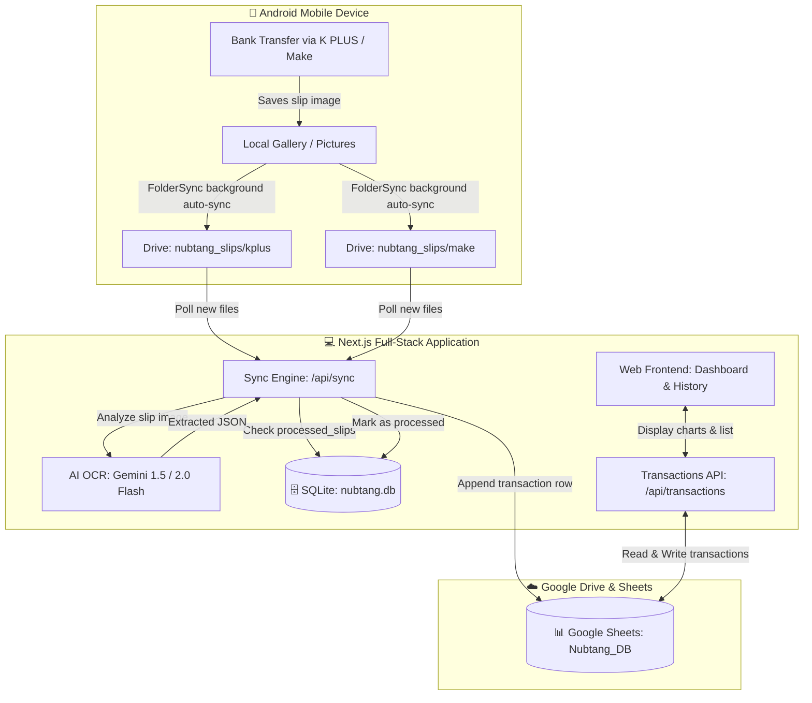

# Architecture Design Specification: Nubtang (นับตังค์)
**Date:** 2026-09-02  
**Status:** Approved by User  
**Repository:** https://github.com/Sonty15/nubtung.git  

---

## 1. Overview & Objectives
**Nubtang (นับตังค์)** is a full-stack personal finance web application built with **Next.js (App Router)**. It provides automated and manual tracking of income and expenses, designed to streamline bank slip recording with zero-touch automation and human-friendly Google Sheets reporting.

### Key Highlights:
- **Full-stack Single Codebase:** Next.js handling both modern UI frontend and backend API/cron handlers.
- **Dual-Database Architecture:**
  - **SQLite (`data/nubtang.db`):** Fast local storage for user credentials (hashed with bcrypt), session cookies, and slip deduplication cache (`processed_slips`).
  - **Google Sheets (`Nubtang_DB`):** Primary database for financial transactions, human-readable formatting, summary sheets, and category management.
- **Automated Bank Slip Ingestion (Zero-Touch):**
  - Mobile background sync (e.g., FolderSync on Android) auto-uploads bank slips into Google Drive folders.
  - Dedicated folders per bank account: `Nubtang/nubtang_slips/kplus` and `Nubtang/nubtang_slips/make`.
  - Server-side background worker scans Drive folders, downloads new slips, runs **Gemini AI OCR** to extract date, time, amount, merchant/recipient, and category.
- **Smart Self-Transfer Detection (โอนย้ายระหว่างบัญชี):**
  - Transfers between own accounts (K PLUS ⇄ Make by KBank) are automatically detected based on the user's name or account details.
  - Categorized as `TRANSFER` so they are **not counted as expenses or income**, preventing double counting.
- **Human-Friendly Google Sheet Design:**
  - Contains three tabs: `📊 สรุปยอด (Summary)`, `📝 รายการทั้งหมด (Transactions)`, and `🏷️ หมวดหมู่ (Categories)`.
  - Column with clickable `=HYPERLINK(drive_url, "ดูสลิป")` to easily view original slips.

---

## 2. System Architecture & Components



---

## 3. Database Schemas

### 3.1 SQLite (`data/nubtang.db`)
- **`users`**:
  - `id` TEXT PRIMARY KEY
  - `username` TEXT UNIQUE NOT NULL
  - `password_hash` TEXT NOT NULL
  - `created_at` DATETIME DEFAULT CURRENT_TIMESTAMP
- **`processed_slips`**:
  - `drive_file_id` TEXT PRIMARY KEY
  - `account` TEXT NOT NULL (e.g., 'K PLUS', 'Make by KBank')
  - `amount` REAL
  - `transaction_date` TEXT
  - `status` TEXT ('SUCCESS', 'FAILED')
  - `created_at` DATETIME DEFAULT CURRENT_TIMESTAMP

### 3.2 Google Sheets (`Nubtang_DB`)

#### Tab 1: `📊 สรุปยอด (Summary)`
- Pre-populated formulas for monthly total income, total expense, net balance, breakdown by account, and breakdown by category.

#### Tab 2: `📝 รายการทั้งหมด (Transactions)`
| Col | Header | Type | Example | Description |
|---|---|---|---|---|
| A | `วันที่` | Date | `2026-09-02` | Transaction Date (YYYY-MM-DD) |
| B | `เวลา` | Text | `12:30:00` | Transaction Time |
| C | `ประเภท` | Text | `🔴 รายจ่าย` / `🟢 รายรับ` / `🔄 โอนย้ายเงิน` | Transaction type |
| D | `จำนวนเงิน` | Number (`#,##0.00`) | `150.00` | Amount in THB |
| E | `หมวดหมู่` | Text | `อาหารและเครื่องดื่ม` | Category |
| F | `บัญชี` | Text | `K PLUS` / `Make by KBank` | Bank/Account Source |
| G | `รายละเอียด / ร้านค้า` | Text | `กะเพราป้าสมศรี` | Note / Recipient info |
| H | `สลิป` | Formula | `=HYPERLINK("...", "ดูสลิป")` | Clickable Drive link |
| I | `รหัสรายการ` | Text | `tx_1725255600_1` | System ID |
| J | `Drive File ID` | Text | `1a2b3c...` | Google Drive File ID |
| K | `ที่มา` | Text | `AUTO_SYNC` / `MANUAL` | Source of record |

#### Tab 3: `🏷️ หมวดหมู่ (Categories)`
- Configurable list of categories editable by user in Sheet or UI.

---

## 4. Next.js Project Structure

```text
nubtang/
├── data/
│   └── nubtang.db                         # SQLite database (git-ignored)
├── public/
├── src/
│   ├── app/
│   │   ├── (auth)/
│   │   │   └── login/page.tsx             # Login interface
│   │   ├── (dashboard)/
│   │   │   ├── layout.tsx                 # Navigation & Auth layout
│   │   │   ├── page.tsx                   # Dashboard (metrics, charts, recent)
│   │   │   └── transactions/page.tsx      # Full transaction log, filters, manual add
│   │   └── api/
│   │       ├── auth/
│   │       │   ├── login/route.ts
│   │       │   ├── logout/route.ts
│   │       │   └── me/route.ts
│   │       ├── transactions/route.ts      # Read / Create rows in Google Sheets
│   │       └── sync/route.ts              # Trigger Drive scan + Gemini OCR + Sheets append
│   ├── components/
│   │   ├── ui/                            # Button, Input, Card, Modal, Badge
│   │   ├── Dashboard/                     # StatCard, MonthlyChart, CategoryChart
│   │   ├── Transactions/                  # TransactionTable, ManualTransactionModal
│   │   ├── SyncButton.tsx                 # Manual sync trigger & sync status
│   │   └── Navbar.tsx                     # Top navigation bar
│   ├── lib/
│   │   ├── db/
│   │   │   └── sqlite.ts                  # SQLite client & schema initialization
│   │   ├── google/
│   │   │   ├── auth.ts                    # Google Cloud Service Account JWT Auth
│   │   │   ├── sheets.ts                  # Sheets API: appendRow, getRows, initHeaders
│   │   │   └── drive.ts                   # Drive API: listFiles, downloadFile
│   │   ├── ai/
│   │   │   └── gemini-slip-ocr.ts         # Gemini Flash OCR prompt & parser
│   │   └── auth/
│   │       └── session.ts                 # Password hashing & JWT cookie verification
│   └── types/
│       └── index.ts                       # Shared TypeScript interfaces
├── .env.example                           # Template environment variables
├── .gitignore                             # Git ignore rules (.env, data/*.db, docs/)
├── package.json
├── tsconfig.json
├── tailwind.config.ts
└── README.md
```

---

## 5. Security & Configuration Requirements
Environment variables configured in `.env.local`:
- `GOOGLE_SERVICE_ACCOUNT_EMAIL`: Service account email
- `GOOGLE_PRIVATE_KEY`: Service account private key
- `GOOGLE_SHEET_ID`: Target Google Sheet spreadsheet ID
- `GOOGLE_DRIVE_KPLUS_FOLDER_ID`: Folder ID for `Nubtang/nubtang_slips/kplus`
- `GOOGLE_DRIVE_MAKE_FOLDER_ID`: Folder ID for `Nubtang/nubtang_slips/make`
- `GEMINI_API_KEY`: API Key from Google AI Studio
- `SESSION_SECRET`: Secret key for session signing
- `USER_DEFAULT_PASSWORD`: Initial admin password for local SQLite
- `OWN_NAMES`: Comma-separated list of user names/accounts to auto-detect self-transfers
