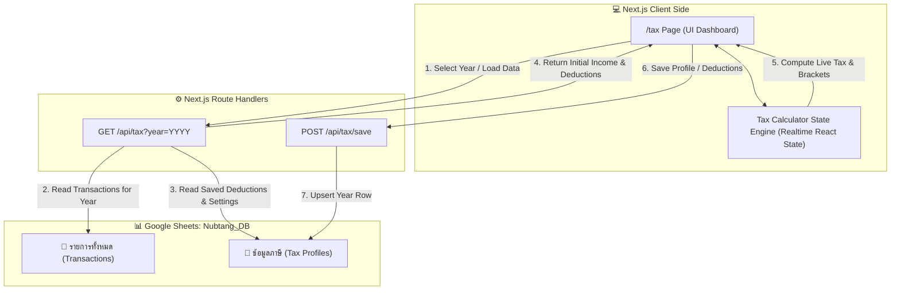

# Architecture Design Specification: ระบบคำนวณภาษีเงินได้บุคคลธรรมดา (Nubtang Personal Income Tax System)
**Date:** 2026-09-14  
**Status:** In Review  
**Repository:** https://github.com/Sonty15/nubtung.git  

---

## 1. Overview & Objectives (ภาพรวมและวัตถุประสงค์)

ระบบคำนวณและวางแผนภาษีเงินได้บุคคลธรรมดา (ภ.ง.ด.90 / ภ.ง.ด.91) เป็นส่วนต่อขยาย (Subsystem) ใหม่ของเว็บแอปพลิเคชัน **นับตังค์ (Nubtang)**
โดยมีวัตถุประสงค์เพื่อ:
1. **คำนวณภาษีเงินได้บุคคลธรรมดาประจำปีอย่างถูกต้อง** ตามประมวลรัษฎากรแห่งประเทศไทย (อัปเดตเกณฑ์ภาษีล่าสุด เช่น ThaiESG, สิทธิลดหย่อนกองทุนเกษียณ และอัตราก้าวหน้า)
2. **โหมดการทำงานแบบไฮบริด (Hybrid Data Flow):**
   - ดึงข้อมูลรายรับ (`INCOME`) ของปีภาษีที่เลือกจาก Google Sheets (`📝 รายการทั้งหมด`) มาจัดกลุ่มตามหมวดหมู่และแมปเป็นประเภทเงินได้พึงประเมิน ม.40(1) - 40(8) เป็นค่าเริ่มต้นให้อัตโนมัติ
   - อนุญาตให้ผู้ใช้ปรับแต่ง/แก้ไขตัวเลขรายได้ หรือทดลองคำนวณจำลองสถานการณ์ (Tax Simulator) ได้อย่างอิสระ
3. **จัดเก็บข้อมูลการวางแผนภาษีลง Google Sheets:** บันทึกและดึงข้อมูลค่าลดหย่อน รายได้ และผลการคำนวณภาษีผ่านแท็บใหม่ชื่อ `📑 ข้อมูลภาษี`
4. **แสดงผลและอธิบายข้อกฎหมายอย่างละเอียด (Educational & Transparent):**
   - แจกแจงขั้นบันไดภาษี 8 ขั้น (0% - 35%) พร้อมไฮไลต์ช่วงเงินได้สุทธิปัจจุบัน
   - เปรียบเทียบผลการคำนวณระหว่าง **วิธีเงินได้สุทธิ (วิธีที่ 1)** และ **วิธีเหมา 0.5% (วิธีที่ 2)**
   - คำนวณสรุปยอดภาษีสุทธิที่ต้องชำระเพิ่ม หรือ ได้รับเงินคืน พร้อมให้คำแนะนำโอกาสในการประหยัดภาษี (Tax Optimization Insights)

---

## 2. Legal Framework & Calculation Engine (หลักเกณฑ์กฎหมายและตรรกะการคำนวณ)

### 2.1 ประเภทเงินได้พึงประเมินและการหักค่าใช้จ่าย (Assessable Income & Legal Expenses)
ตามประมวลรัษฎากร มาตรา 40:
| ประเภทเงินได้ | รายละเอียด | สิทธิหักค่าใช้จ่ายตามกฎหมาย |
|---|---|---|
| **ม.40(1)** | เงินเดือน, ค่าจ้าง, โบนัส, เบี้ยเลี้ยง | หักได้ 50% รวมกับ 40(2) สูงสุดไม่เกิน **100,000 บาท** |
| **ม.40(2)** | ค่าจ้างฟรีแลนซ์, ค่านายหน้า, รับจ้างทั่วไป | หักได้ 50% รวมกับ 40(1) สูงสุดไม่เกิน **100,000 บาท** |
| **ม.40(3)** | ค่าลิขสิทธิ์, สิทธิบัตร, ทรัพย์สินทางปัญญา | หักได้ 50% สูงสุดไม่เกิน **100,000 บาท** |
| **ม.40(4)** | ดอกเบี้ย, เงินปันผล, ผลประโยชน์คริปโต | หักค่าใช้จ่ายไม่ได้ (0%) |
| **ม.40(5)** | ค่าเช่าทรัพย์สิน (บ้าน/อาคาร/ที่ดิน/ยานพาหนะ) | หักเหมา 30% (บ้าน/อาคาร) หรือ 10-20% ตามประเภท |
| **ม.40(6)** | วิชาชีพอิสระ (โรคศิลปะ 60%, บัญชี/กฎหมาย/วิศวะ/สถาปัตย์ 30%) | หักเหมา 30% - 60% |
| **ม.40(7)** | รับเหมาก่อสร้าง (ผู้รับเหมาจัดหาทั้งของและแรงงาน) | หักเหมา 60% |
| **ม.40(8)** | การพาณิชย์, ขายของออนไลน์, ธุรกิจอื่นๆ | หักเหมา 60% |

### 2.2 ค่าลดหย่อนภาษีตามเกณฑ์กฎหมาย (Tax Deductions & Ceilings)
แบ่งออกเป็น 4 หมวดหมู่หลัก:
1. **หมวดตนเองและครอบครัว:**
   - ผู้มีเงินได้ (ตนเอง): 60,000 บาท (ทุกคน)
   - คู่สมรส (ไม่มีเงินได้และจดทะเบียนสมรส): 60,000 บาท
   - บุตร: คนละ 30,000 บาท (บุตรคนที่ 2 ขึ้นไปที่เกิดตั้งแต่ปี 2561 คนละ 60,000 บาท)
   - บิดา-มารดา (อายุ 60 ปีขึ้นไป รายได้ทั้งปีไม่เกิน 30,000 บ.): คนละ 30,000 บาท (สูงสุด 4 คน ทั้งตนเองและคู่สมรส)
   - ผู้พิการ/ทุพพลภาพ: คนละ 60,000 บาท
2. **หมวดประกันและการออมทั่วไป:**
   - ประกันสังคม (SSO): ตามจ่ายจริง สูงสุด 9,000 บาท
   - ประกันชีวิตทั่วไป + เงินฝากสงเคราะห์ชีวิต: สูงสุด 100,000 บาท
   - ประกันสุขภาพตนเอง: สูงสุด 25,000 บาท (เมื่อรวมกับประกันชีวิตทั่วไป ต้องไม่เกิน 100,000 บาท)
   - ประกันสุขภาพบิดามารดา: สูงสุด 15,000 บาท
3. **หมวดกองทุนเพื่อการเกษียณและกระตุ้นเศรษฐกิจ:**
   - **กลุ่มเกษียณ (รวมกันไม่เกิน 500,000 บาท):**
     - RMF: ไม่เกิน 30% ของเงินได้พึงประเมิน สูงสุด 500,000 บาท
     - SSF: ไม่เกิน 30% ของเงินได้พึงประเมิน สูงสุด 200,000 บาท
     - กบข. / กองทุนสำรองเลี้ยงชีพ (PVD): ไม่เกิน 15% ของเงินได้พึงประเมิน สูงสุด 500,000 บาท
     - ประกันชีวิตแบบบำนาญ: ไม่เกิน 15% ของเงินได้พึงประเมิน สูงสุด 200,000 บาท
   - **กองทุน ThaiESG (แยกอิสระจากกลุ่ม 500k):** ไม่เกิน 30% ของเงินได้พึงประเมิน สูงสุด 300,000 บาท
4. **หมวดอสังหาฯ, บริจาค และมาตรการรัฐ:**
   - ดอกเบี้ยเงินกู้ยืมเพื่อซื้อที่อยู่อาศัย: ตามจริง สูงสุด 100,000 บาท
   - มาตรการกระตุ้นเศรษฐกิจ (เช่น Easy E-Receipt): ตามสิทธิของปีภาษีนั้น
   - เงินบริจาคเพื่อการศึกษา การกีฬา สถานพยาบาลรัฐ (e-Donation): ลดหย่อนได้ 2 เท่าของยอดบริจาคจริง
   - เงินบริจาคทั่วไป: ลดหย่อนได้ตามจริง
   - *(เพดานเงินบริจาครวมกัน: ไม่เกิน 10% ของเงินได้หลังหักค่าใช้จ่ายและค่าลดหย่อนอื่นๆ แล้ว)*

### 2.3 สูตรคำนวณและอัตราภาษี (Calculation Logic & Formulas)
1. **วิธีที่ 1: คำนวณจากเงินได้สุทธิ (Net Taxable Income)**
   $$\text{เงินได้สุทธิ} = \text{เงินได้พึงประเมินรวม} - \text{ค่าใช้จ่ายที่หักได้} - \text{ค่าลดหย่อนรวม}$$
   นำเงินได้สุทธิมาคำนวณภาษีตามอัตราก้าวหน้า 8 ขั้น:
   - 0 – 150,000 บาท: 0% (ยกเว้น)
   - 150,001 – 300,000 บาท: 5% (ภาษีสูงสุดในขั้น 7,500 บาท)
   - 300,001 – 500,000 บาท: 10% (ภาษีสูงสุดในขั้น 20,000 บาท)
   - 500,001 – 750,000 บาท: 15% (ภาษีสูงสุดในขั้น 37,500 บาท)
   - 750,001 – 1,000,000 บาท: 20% (ภาษีสูงสุดในขั้น 50,000 บาท)
   - 1,000,001 – 2,000,000 บาท: 25% (ภาษีสูงสุดในขั้น 250,000 บาท)
   - 2,000,001 – 5,000,000 บาท: 30% (ภาษีสูงสุดในขั้น 900,000 บาท)
   - มากกว่า 5,000,000 บาท: 35%

2. **วิธีที่ 2: วิธีเหมา 0.5% (สำหรับเงินได้ที่ไม่ใช่ ม.40(1))**
   - เงื่อนไข: ยอดเงินได้รวมที่ไม่ใช่ 40(1) (เช่น 40(2) ถึง 40(8)) $\ge 120,000$ บาท
   - ภาษี = $\text{เงินได้รวมที่ไม่ใช่ 40(1)} \times 0.005$
   - ข้อยกเว้น: หากคำนวณได้ไม่เกิน 5,000 บาท กฎหมายยกเว้นไม่ต้องเสียตามวิธีนี้

3. **สรุปภาษีสุทธิ:**
   $$\text{ภาษีที่ต้องชำระ} = \max(\text{วิธีที่ 1}, \text{วิธีที่ 2}) - \text{ภาษีหัก ณ ที่จ่ายสะสม}$$
   - หากผลลัพธ์ $> 0$: ต้องชำระภาษีเพิ่มเติม
   - หากผลลัพธ์ $< 0$: ได้รับเงินคืนภาษี

---

## 3. Architecture & Data Flow (สถาปัตยกรรมและการไหลของข้อมูล)

---

## 4. Google Sheets Schema (`📑 ข้อมูลภาษี`)

หากแท็บ `📑 ข้อมูลภาษี` ยังไม่มีใน Google Sheet ระบบจะสร้างแท็บนี้ให้อัตโนมัติพร้อมส่วนหัว (Headers):

| คอลัมน์ | ชื่อหัวตาราง | รายละเอียดข้อมูล |
|---|---|---|
| A | `ปีภาษี (Year)` | เช่น `2025` (ใช้เป็น Primary Key สำหรับการ Upsert) |
| B | `เงินได้พึงประเมินรวม` | ผลรวมเงินได้ 40(1) ถึง 40(8) |
| C | `40(1) เงินเดือน` | รายได้จากเงินเดือน/โบนัส |
| D | `40(2) ฟรีแลนซ์/รับจ้าง` | รายได้จากรับจ้าง/ฟรีแลนซ์/ค่านายหน้า |
| E | `40(3) ค่าลิขสิทธิ์` | รายได้จากทรัพย์สินทางปัญญา |
| F | `40(4) ดอกเบี้ย/ปันผล` | รายได้จากดอกเบี้ย/เงินปันผล/คริปโต |
| G | `40(5) ค่าเช่า` | รายได้จากการให้เช่าทรัพย์สิน |
| H | `40(6) วิชาชีพอิสระ` | รายได้จากวิชาชีพอิสระ |
| I | `40(7) รับเหมา` | รายได้จากรับเหมาก่อสร้าง/จัดหาของ |
| J | `40(8) อื่นๆ/ธุรกิจ` | รายได้จากการค้าขาย/ธุรกิจ |
| K | `ค่าใช้จ่ายที่หักได้` | ผลรวมค่าใช้จ่ายที่หักได้ตามกฎหมาย |
| L | `ลดหย่อนตนเองและครอบครัว` | ผลรวมค่าลดหย่อนกลุ่มที่ 1 |
| M | `ลดหย่อนประกันและการออม` | ประกันสังคม, ประกันชีวิต, ประกันสุขภาพ |
| N | `ลดหย่อนกองทุนเกษียณและThaiESG` | RMF, SSF, PVD, ThaiESG |
| O | `ลดหย่อนอสังหาฯและมาตรการรัฐ` | ดอกเบี้ยบ้าน, ช้อปดีมีคืน/Easy E-Receipt |
| P | `เงินบริจาคที่หักได้` | เงินบริจาคหลังคำนวณเพดาน 10% |
| Q | `เงินได้สุทธิ` | เงินได้หลังหักค่าใช้จ่ายและลดหย่อน |
| R | `ภาษีที่คำนวณได้` | ภาษีตามวิธีที่สูงกว่า (วิธี 1 หรือ วิธี 2) |
| S | `ภาษีหัก ณ ที่จ่าย` | ยอดภาษีที่ถูกหักไว้แล้ว |
| T | `ภาษีที่ต้องจ่ายเพิ่ม (คืน)` | ยอดสุทธิ (ติดลบคือได้คืน) |
| U | `รายละเอียดค่าลดหย่อน (JSON)` | บันทึกรายละเอียดค่าลดหย่อนแต่ละช่องเป็น JSON เพื่อโหลดกลับมาแสดงในหน้าเว็บได้อย่างครบถ้วน |
| V | `อัปเดตล่าสุด` | วันและเวลาที่บันทึกล่าสุด เช่น `2026-09-14 22:30:00` |

---

## 5. Category to Tax Income Mapping (การจับคู่หมวดหมู่กับประเภทภาษี)

ระบบจะกำหนดค่าเริ่มต้นสำหรับจับคู่หมวดหมู่รายรับ (Income Category) ไปยังประเภทเงินได้พึงประเมิน (ม.40(1) - 40(8)) ดังนี้:

* **หมวดหมู่อัตโนมัติ:**
  - `เงินเดือน`, `โบนัส`, `Salary`, `Bonus`, `เงินเดือนประจำ` $\rightarrow$ **ม.40(1)**
  - `ฟรีแลนซ์`, `รับจ้าง`, `Freelance`, `จ้างทำของ`, `ค่านายหน้า` $\rightarrow$ **ม.40(2)**
  - `ลิขสิทธิ์`, `Royalty` $\rightarrow$ **ม.40(3)**
  - `ดอกเบี้ย`, `เงินปันผล`, `Dividend`, `Interest`, `คริปโต` $\rightarrow$ **ม.40(4)**
  - `ค่าเช่า`, `Rental` $\rightarrow$ **ม.40(5)**
  - `วิชาชีพอิสระ` $\rightarrow$ **ม.40(6)**
  - `รับเหมา` $\rightarrow$ **ม.40(7)**
  - `ขายของ`, `ธุรกิจ`, `รายได้อื่นๆ`, `Other` $\rightarrow$ **ม.40(8)**
* ผู้ใช้สามารถแก้ไขสลับประเภทยอดเงิน หรือปรับยอดรวมในฟอร์มหน้าเว็บได้ตลอดเวลา

---

## 6. Frontend UI Components (`src/app/tax/page.tsx`)

1. **Header & Navigation:**
   - เพิ่มลิงก์ "ภาษี (Tax)" ใน [Navbar.tsx](file:///home/sonty/Documents/Personal/nubtang/src/components/Navbar.tsx) และ [MobileBottomNav.tsx](file:///home/sonty/Documents/Personal/nubtang/src/components/MobileBottomNav.tsx)
2. **Tax Year Toolbar:**
   - Dropdown เลือกปีภาษี (ปีปัจจุบัน และย้อนหลัง/ล่วงหน้า 3 ปี)
   - ปุ่ม `ดึงรายได้จากรายการบัญชี` (Sync Income)
   - ปุ่ม `บันทึกลง Google Sheet` (Save to Sheet) พร้อม Toast แจ้งสถานะ
   - Switch สลับโหมดจำลองตัวเลข (Manual Edit Toggle)
3. **KPI Summary Cards (Real-time):**
   - 4 การ์ดหลัก: เงินได้รวม, ค่าใช้จ่ายที่หักได้, ค่าลดหย่อนรวม, เงินได้สุทธิ
   - 1 การ์ดเน้นพิเศษ: ยอดภาษีสุทธิ (ชำระเพิ่มเป็นสีส้ม/แดง / ได้คืนภาษีเป็นสีเขียว พร้อมไอคอน)
4. **Income Breakdown Accordion/Card:**
   - แสดงรายได้แยก ม.40(1) ถึง ม.40(8)
   - ช่อง Input ปรับแต่งยอดเงิน พร้อมแสดงสิทธิหักค่าใช้จ่ายของแต่ละประเภท
5. **Deductions Configuration Form (4 Sections):**
   - ตนเอง & ครอบครัว (ส่วนตัว 60,000 ล็อกไว้, บุตร, บิดามารดา)
   - ประกัน & เงินออม (ประกันสังคม max 9,000, ประกันชีวิต max 100,000, ประกันสุขภาพ max 25,000)
   - กองทุนเกษียณ & ThaiESG (RMF, SSF, PVD แสดงผลรวมไม่เกิน 500k, ThaiESG แสดงแยก max 300k)
   - ดอกเบี้ยบ้าน, Easy E-Receipt, เงินบริจาค, ภาษีหัก ณ ที่จ่าย
6. **Tax Brackets & Legal Insights Component:**
   - ตารางแจกแจงขั้นบันไดภาษี 8 ขั้น ระบุช่วงเงินได้ อัตราภาษี ภาษีแต่ละขั้น และไฮไลต์ขั้นปัจจุบันของผู้ใช้
   - กล่องอธิบายเปรียบเทียบวิธีคำนวณปกติ vs วิธีเหมา 0.5%
   - คำแนะนำในการประหยัดภาษี (Tax Optimization Tip) ตามฐานภาษีปัจจุบัน

---

## 7. Implementation File Structure & Changes (รายการไฟล์ที่จะเพิ่ม/แก้ไข)

1. **`src/lib/tax/tax-engine.ts` (ใหม่):**
   - Core tax calculation logic: Pure TypeScript function สำหรับคำนวณค่าใช้จ่าย, ค่าลดหย่อน, ตรวจสอบเพดาน, ขั้นบันไดภาษี และวิธีเหมา 0.5%
2. **`src/lib/tax/category-mapping.ts` (ใหม่):**
   - Logic จับคู่ชื่อหมวดหมู่รายรับ เข้ากับ ม.40(1) - 40(8)
3. **`src/lib/google/sheets.ts` (แก้ไข):**
   - เพิ่มฟังก์ชัน `ensureTaxSheetExists()`, `getTaxProfile(year)`, `saveTaxProfile(taxData)`
4. **`src/app/api/tax/route.ts` (ใหม่):**
   - `GET`: ดึงข้อมูลรายรับของปีภาษี + ข้อมูลค่าลดหย่อนที่บันทึกไว้ใน Google Sheets
   - `POST`: บันทึกข้อมูลการคำนวณและค่าลดหย่อนลงในชีต `📑 ข้อมูลภาษี`
5. **`src/app/tax/page.tsx` (ใหม่):**
   - หน้า UI หลักสำหรับคำนวณและวางแผนภาษี
6. **`src/components/Tax/...` (ใหม่):**
   - `TaxSummaryCards.tsx`: การ์ดสรุปยอด
   - `TaxIncomeForm.tsx`: ฟอร์มและตารางแจกแจงรายได้
   - `TaxDeductionsForm.tsx`: ฟอร์มกรอกค่าลดหย่อน 4 หมวด
   - `TaxBracketTable.tsx`: ตารางขั้นบันไดและคำอธิบายกฎหมาย
7. **`src/components/Navbar.tsx` & `src/components/MobileBottomNav.tsx` (แก้ไข):**
   - เพิ่มเมนูเข้าสู่หน้า `/tax`

---

## 8. Verification & Testing Strategy (การตรวจสอบและทดสอบ)

1. **Unit Tests for Tax Engine (`src/lib/tax/tax-engine.test.ts`):**
   - ทดสอบเงินได้ ม.40(1) อย่างเดียว (เช่น เงินเดือน 50,000 บ./เดือน รวม 600,000 บ./ปี หักค่าใช้จ่าย 100,000 บ. หักลดหย่อนส่วนตัว 60,000 บ. เงินได้สุทธิ 440,000 บ. คำนวณภาษีขั้น 5% และ 10%)
   - ทดสอบเพดานค่าใช้จ่าย 40(1) + 40(2) รวมกันไม่เกิน 100,000 บาท
   - ทดสอบเพดานกลุ่มเกษียณ 500,000 บาท และ ThaiESG 300,000 บาท
   - ทดสอบเงื่อนไขวิธีเหมา 0.5% สำหรับเงินได้ ม.40(2)-(8) ทั้งกรณียกเว้น ($\le 5,000$) และกรณีเสียภาษี
   - ทดสอบภาษีหัก ณ ที่จ่าย ทั้งกรณีชำระเพิ่ม และกรณีได้คืนภาษี
2. **End-to-End & Integration Testing:**
   - ทดสอบการดึงข้อมูล Transaction จาก Google Sheets ในปีที่กำหนด
   - ทดสอบการบันทึก (Upsert) ข้อมูลลงแท็บ `📑 ข้อมูลภาษี`
   - ทดสอบการตอบสนองของ UI ในโหมด Light และ Dark Mode ทั้งบน Desktop และ Mobile
